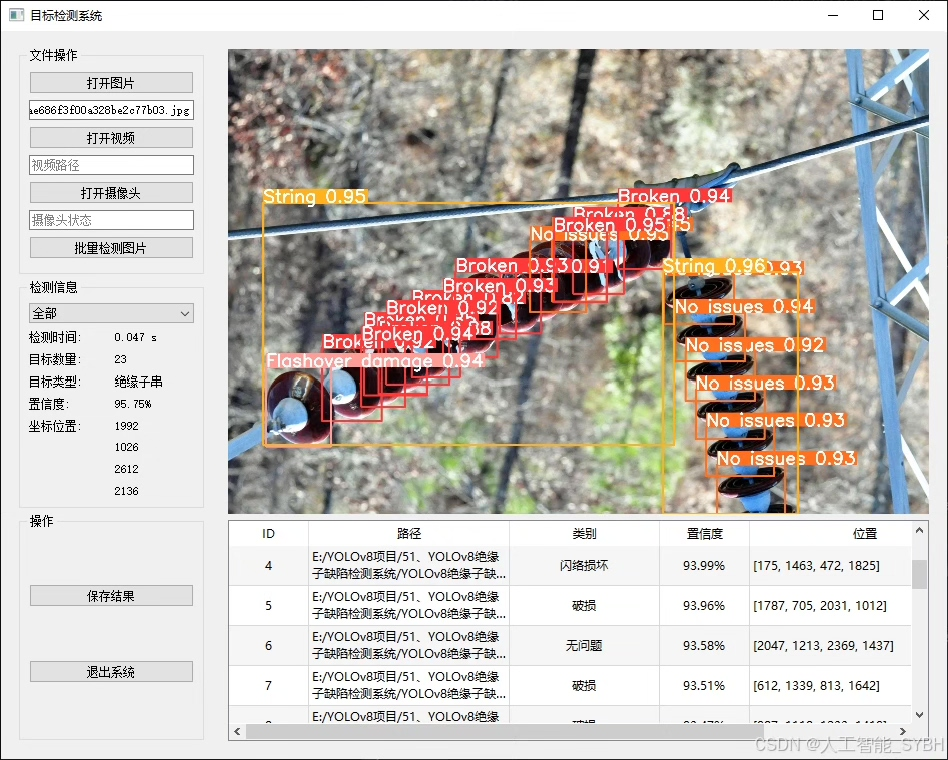
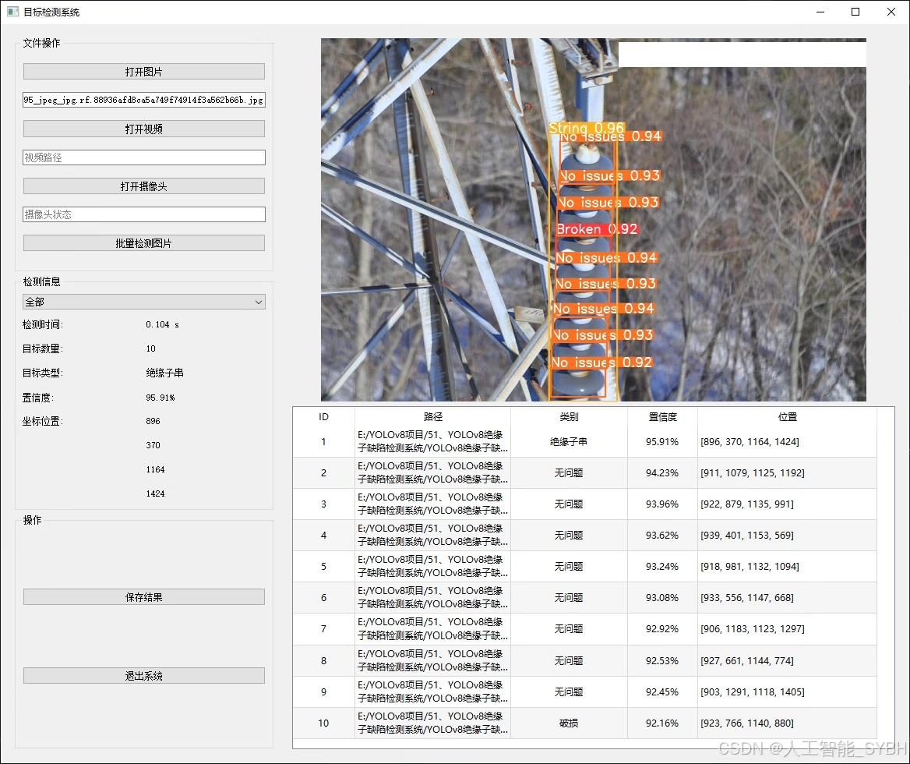
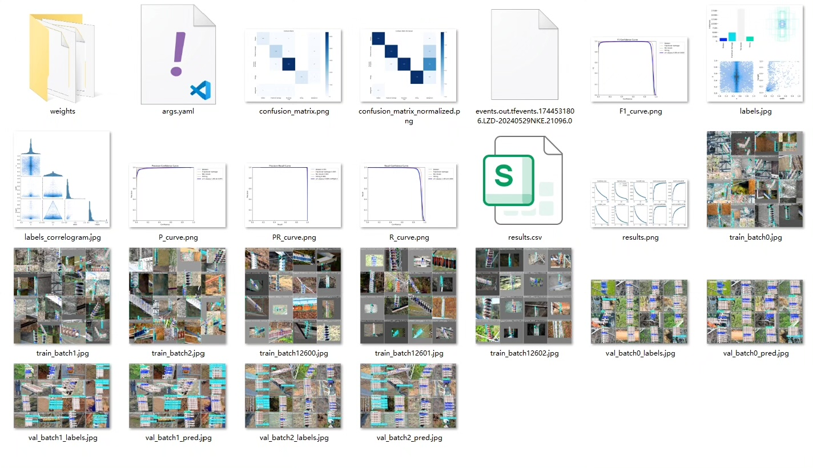
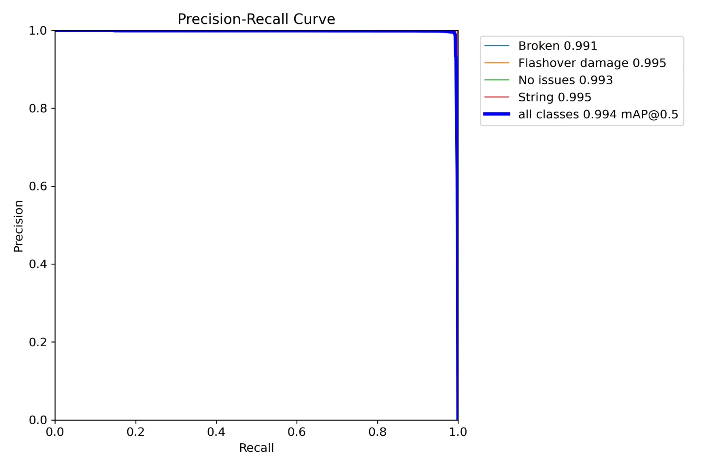
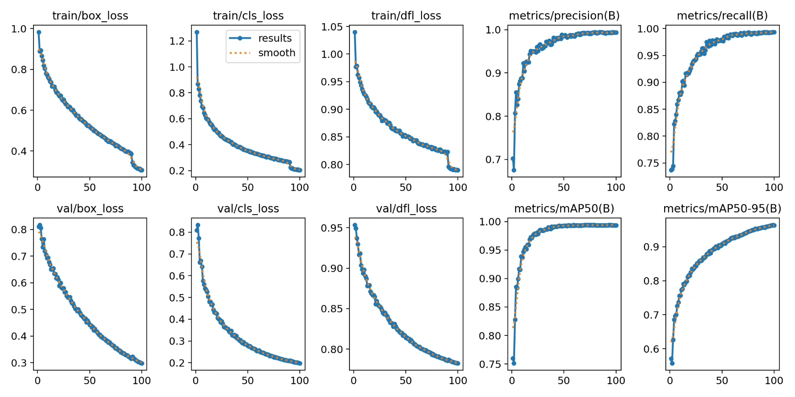
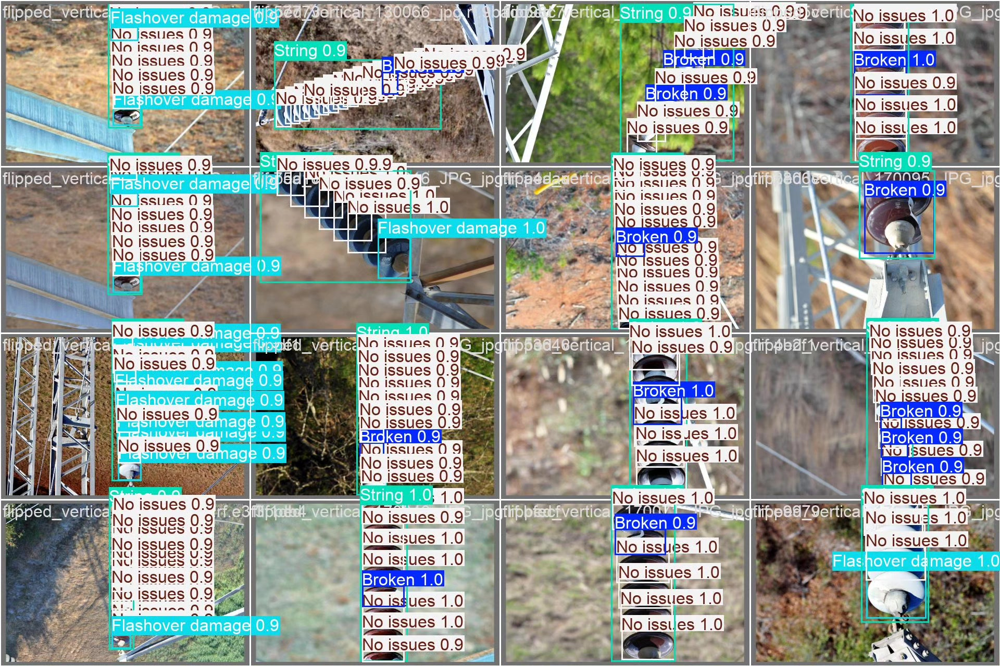
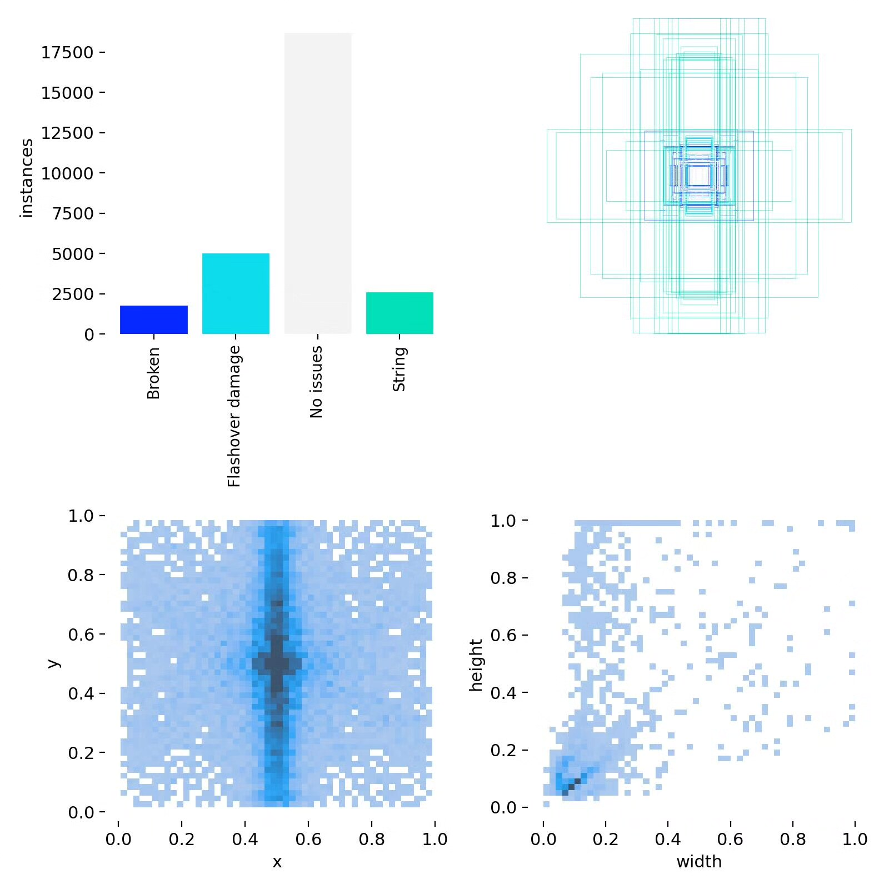
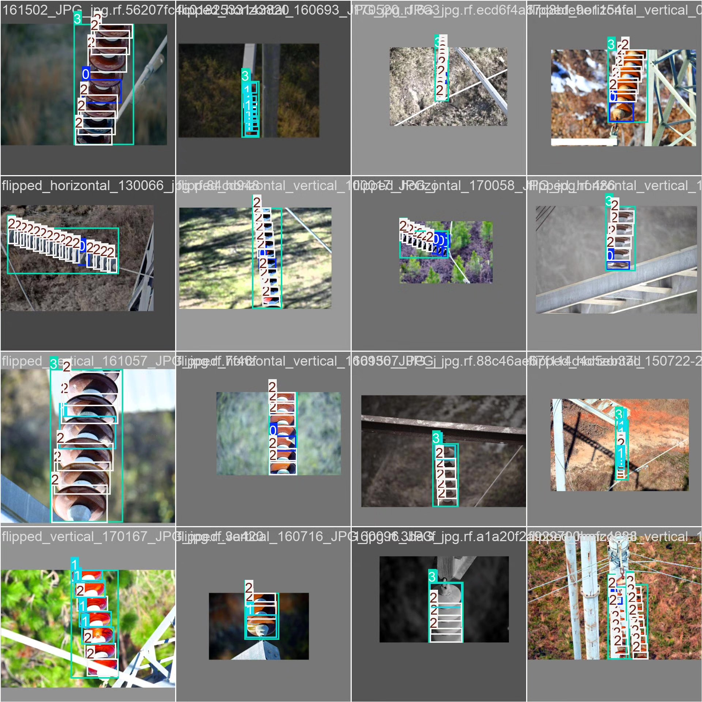

# Based on YOLOv8 deep learning, an insulator defect detection system (YOLOv8+)

## Body

Based on the advanced YOLOv8 object detection algorithm, this project has developed a set of intelligent systems specifically for the detection of insulator defects in power systems. The system is designed to identify four states of insulators (broken, flashover damage, normal state, and string) with high precision. The training set contains 2240 labeled images, the validation set includes 640 images, and the test set consists of 320 images, totaling 3200 professional collected images of insulators. Through deep learning technology, the system can automatically recognize the types of defects in the insulators, providing real-time and accurate detection results for power equipment maintenance. This system realizes the transition from traditional manual inspection to intelligent automatic detection, significantly improving the efficiency and accuracy of inspection, and reducing the cost of power system operation and safety risks.

The company's products have obtained the official commercial license certification from YOLO.

We provide after-sales service.

After payment, we will provide WeChat ID for any questions.

Environmental configuration: We will provide a tutorial on environmental configuration, and WeChat will provide answers to questions.

Remote installation service: If you need remote configuration, an additional fee of 69 is required,
failure in configuration will result in all fees being refunded (specially for old computers only refund installation fees).

Retraining dataset: After configuring the environment, you can train on your own computer.
If you need us to retrain, just pay 69+ computing power fees (2.5 yuan/hour)

## Images

## Payment

Here is a pay link on Stripe ( https://buy.stripe.com/3cs8yP7sY87d0vu9AB ). Please contact me lonlonago@foxmail.com after funding $89, and I will send you a complete data files , thank you!

